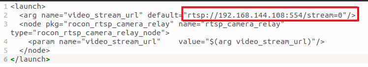

# rtsp流转ros操作
## 原因
1. 由于使用arm架构的NX，使用VLC时会出现问题，导致拉流失败，无法实时显示rtsp流
2. rtsp转ros话题后可以在一个rviz内显示图像信息、点云、轨迹、定位等信息，集成度更高

## 具体实现
1. 参考了[ros-rtsp流相机功能包](https://github.com/amov-lab/HOMER_WIKI/blob/master/homer_document/source/docs/9ROS-RTSP%E6%B5%81%E7%9B%B8%E6%9C%BA%E5%8A%9F%E8%83%BD%E5%8C%85.rst)
2. [源码](https://github.com/robotics-in-concert/rocon_devices)地址
3. 终端输入
```shell
mkdir -p rtsp_ws/src
cd ~/rtsp_ws/src
git clone https://github.com/robotics-in-concert/rocon_devices
cd ..
catkin_make
```
4. 修改launch文件
```shell
cd ~/rtsp_ws/src/rocon_devices/rocon_rtsp_camera_relay/launch/

gedit rtsp_camera_relay.launch
```
5. launch文件中添加rtsp地址
如下图所示
6. 启动launch文件
```shell
source devel/setup.zsh
roslaunch rocon_rtsp_camera_relay rtsp_camera_relay.launch --screen
```
7. 打开rqt_image_viewer查看
```shell
rqt_image_viewer
```
